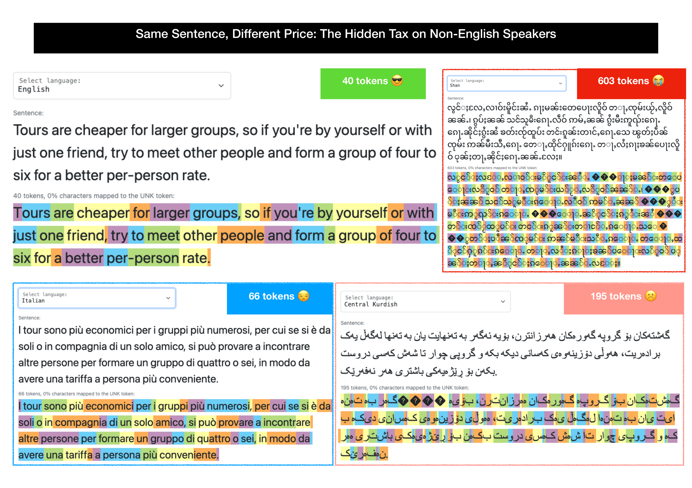
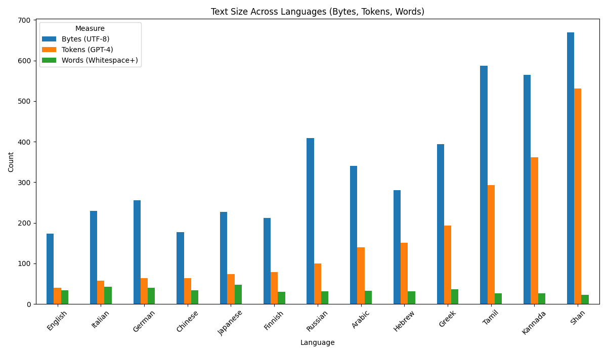

# Words Segmentation

This repository contains a pretokenizer that segments text into "words" for further processing.

We define three classes of tokens:

1. `C0` Control tokens (always atomic)
2. "Words" = runs of non-space, non-control + optional single trailing whitespace
3. Whitespace runs

For any script where the default is not suitable, you can implement a custom pretokenizer.
Modify `LANGUAGE_SPECS` in [languages.py](./words_segmentation/languages.py) to add a custom function for specific
scripts.

For example:

```python
LANGUAGE_SPECS: Dict[str, LanguageSpec] = {
    "Chinese": {
        "scripts": ("Han",),
        "callback": segment_chinese,
    },
    "Japanese": {
        "scripts": ("Han", "Hiragana", "Katakana"),
        "callback": segment_japanese,
    },
}
```

Then, with a `max_bytes` parameter, we split long words into smaller chunks while preserving
Unicode grapheme boundaries.

## Usage

Install:

```bash
pip install words-segmentation
```

Pretokenize text using a Huggingface Tokenizer implementation:

```python
from words_segmentation.tokenizer import WordsSegmentationTokenizer

pretokenizer = WordsSegmentationTokenizer(max_bytes=16)
tokens = pretokenizer.tokenize("hello world! 我爱北京天安门 👩‍👩‍👧‍👦")
# ['hello ', 'world! ', '我', '爱', '北京', '天安门', ' ', '👩‍👩‍👧‍👦‍']
```

### Disabling Language-Specific Segmentation

You can disable language-specific segmentation for certain languages 
using the `LANGUAGES_NO_SPLIT` environment variable.
This is useful when you want specific languages to fall back to the default 
word-boundary segmentation instead of using their specialized tokenizers.

```bash
export LANGUAGES_NO_SPLIT="Chinese,Japanese"
python your_script.py
```

## [Writing systems without word boundaries](https://en.wikipedia.org/wiki/Category:Writing_systems_without_word_boundaries)

Perhaps there will come a day when we could have a universal pretokenizer that works for all languages.
Until then, we need to handle some writing systems with custom logic.
We implement custom fallback pretoknizers for the following writing systems:

- [x] [Chinese characters](https://en.wikipedia.org/wiki/Chinese_characters) -
  using [jieba](https://github.com/fxsjy/jieba)
- [x] [Japanese writing system](https://en.wikipedia.org/wiki/Japanese_writing_system) -
  using [fugashi](https://github.com/polm/fugashi)
- [x] [Thai script](https://en.wikipedia.org/wiki/Thai_script) -
  using [PyThaiNLP](https://github.com/PyThaiNLP/pythainlp)
- [ ] [Balinese script](https://en.wikipedia.org/wiki/Balinese_script)
- [ ] [Burmese alphabet](https://en.wikipedia.org/wiki/Burmese_alphabet)
- [ ] [Chữ Hán](https://en.wikipedia.org/wiki/Ch%E1%BB%AF_H%C3%A1n)
- [ ] [Chữ Nôm](https://en.wikipedia.org/wiki/Ch%E1%BB%AF_N%C3%B4m)
- [ ] [Hanja](https://en.wikipedia.org/wiki/Hanja)
- [ ] [Javanese script](https://en.wikipedia.org/wiki/Javanese_script)
- [ ] [Khmer script](https://en.wikipedia.org/wiki/Khmer_script)
- [ ] [Lao script](https://en.wikipedia.org/wiki/Lao_script)
- [ ] [ʼPhags-pa script](https://en.wikipedia.org/wiki/%CA%BCPhags-pa_script)
- [ ] [Rasm](https://en.wikipedia.org/wiki/Rasm)
- [ ] [Sawndip](https://en.wikipedia.org/wiki/Sawndip)
- [ ] [Scriptio continua](https://en.wikipedia.org/wiki/Scriptio_continua)
- [ ] [S'gaw Karen alphabet](https://en.wikipedia.org/wiki/S%27gaw_Karen_alphabet)
- [ ] [Tai Tham script](https://en.wikipedia.org/wiki/Tai_Tham_script)
- [ ] [Tibetan script](https://en.wikipedia.org/wiki/Tibetan_script)
- [ ] [Vietnamese alphabet](https://en.wikipedia.org/wiki/Vietnamese_alphabet)
- [ ] [Western Pwo alphabet](https://en.wikipedia.org/wiki/Western_Pwo_alphabet)

## Tokenization Parity

[Foroutan and Meister et al. (2025)](https://www.arxiv.org/pdf/2508.04796) note that:
> In multilingual models, the same meaning can take far more tokens in some languages,
> penalizing users of underrepresented languages with worse performance and higher API costs.

[](https://www.linkedin.com/posts/sina-ahmadi-aba470287_dont-speak-english-you-must-pay-more-activity-7360959825893036035-vnFN)

Let's consider the same example, for whitespace pre-tokenization parity:

| Language | Text (Google Translate)                                                                                                                                                                                                                                      | Bytes (UTF-8) | Tokens (GPT-4) | Words (Whitespace+) |
|----------|--------------------------------------------------------------------------------------------------------------------------------------------------------------------------------------------------------------------------------------------------------------|---------------|----------------|---------------------|
| English  | Tours are cheaper for larger groups, so if you're by yourself or with just one friend, try to meet other people and form a group of four to six for a better per-person rate.                                                                                | 173           | 40             | 34                  |
| Italian  | I tour sono più economici per i gruppi più numerosi, quindi se sei da solo o con un solo amico, prova a incontrare altre persone e a formare un gruppo da quattro a sei persone per ottenere una tariffa più conveniente a persona.                          | 230           | 58             | 43                  |
| German   | Touren sind für größere Gruppen günstiger. Wenn Sie also alleine oder mit nur einem Freund unterwegs sind, versuchen Sie, andere Leute kennenzulernen und eine Gruppe von vier bis sechs Personen zu bilden, um einen besseren Preis pro Person zu erhalten. | 256           | 64             | 40                  |
| Chinese  | 团体旅游价格更便宜，所以如果您独自一人或只有一个朋友，请尝试结识其他人并组成一个四到六人的团体，以获得更好的每人价格。                                                                                                                                                                                                  | 177           | 64             | 34                  |
| Japanese | ツアーはグループが多ければ安くなるので、一人または友達とだけ参加する場合は、他の人と会って4人から6人のグループを作ると、一人当たりの料金が安くなります。                                                                                                                                                                                | 227           | 74             | 48                  |
| Finnish  | Retket ovat halvempia suuremmille ryhmille, joten jos olet yksin tai vain yhden ystävän kanssa, yritä tavata muita ihmisiä ja muodosta neljän tai kuuden hengen ryhmä saadaksesi paremman hinnan per henkilö.                                                | 212           | 79             | 30                  |
| Russian  | Туры обходятся дешевле для больших групп, поэтому, если вы одни или с одним другом, постарайтесь познакомиться с другими людьми и сформировать группу из четырех-шести человек, чтобы получить более выгодную цену на человека.                              | 409           | 100            | 32                  |
| Arabic   | تكون الجولات أرخص بالنسبة للمجموعات الكبيرة، لذلك إذا كنت بمفردك أو مع صديق واحد فقط، فحاول مقابلة أشخاص آخرين وتشكيل مجموعة مكونة من أربعة إلى ستة أشخاص للحصول على سعر أفضل للشخص الواحد.                                                                  | 341           | 140            | 33                  |
| Hebrew   | סיורים זולים יותר לקבוצות גדולות יותר, כך שאם אתם לבד או עם חבר אחד בלבד, נסו לפגוש אנשים אחרים וליצור קבוצה של ארבעה עד שישה אנשים לקבלת מחיר טוב יותר לאדם.                                                                                                | 281           | 151            | 31                  |
| Greek    | Οι εκδρομές είναι φθηνότερες για μεγαλύτερες ομάδες, οπότε αν είστε μόνοι σας ή με έναν μόνο φίλο, προσπαθήστε να γνωρίσετε άλλα άτομα και να σχηματίσετε μια ομάδα τεσσάρων έως έξι ατόμων για καλύτερη τιμή ανά άτομο.                                     | 394           | 193            | 36                  |
| Tamil    | பெரிய குழுக்களுக்கு சுற்றுலாக்கள் மலிவானவை, எனவே நீங்கள் தனியாகவோ அல்லது ஒரு நண்பருடனோ இருந்தால், மற்றவர்களைச் சந்தித்து நான்கு முதல் ஆறு பேர் கொண்ட குழுவை உருவாக்கி, ஒரு நபருக்கு சிறந்த விலையைப் பெற முயற்சிக்கவும்.                                      | 587           | 293            | 26                  |
| Kannada  | ದೊಡ್ಡ ಗುಂಪುಗಳಿಗೆ ಪ್ರವಾಸಗಳು ಅಗ್ಗವಾಗಿರುತ್ತವೆ, ಆದ್ದರಿಂದ ನೀವು ಒಬ್ಬಂಟಿಯಾಗಿ ಅಥವಾ ಒಬ್ಬ ಸ್ನೇಹಿತನೊಂದಿಗೆ ಇದ್ದರೆ, ಇತರ ಜನರನ್ನು ಭೇಟಿ ಮಾಡಲು ಪ್ರಯತ್ನಿಸಿ ಮತ್ತು ಪ್ರತಿ ವ್ಯಕ್ತಿಗೆ ಉತ್ತಮ ದರಕ್ಕಾಗಿ ನಾಲ್ಕರಿಂದ ಆರು ಜನರ ಗುಂಪನ್ನು ರಚಿಸಿ.                                              | 565           | 361            | 26                  |
| Shan     | ၶၢဝ်းတၢင်း တႃႇၸုမ်းယႂ်ႇၼၼ်ႉ ၵႃႈၶၼ်မၼ်း ထုၵ်ႇလိူဝ်လႄႈ သင်ဝႃႈ ၸဝ်ႈၵဝ်ႇ ယူႇႁင်းၵူၺ်း ဢမ်ႇၼၼ် မီးဢူၺ်းၵေႃႉ ၵေႃႉလဵဝ်ၵွႆးၼႆၸိုင် ၶတ်းၸႂ် ႁူပ်ႉထူပ်း ၵူၼ်းတၢင်ႇၵေႃႉသေ ႁဵတ်းၸုမ်း 4 ၵေႃႉ တေႃႇထိုင် 6 ၵေႃႉ ႁႂ်ႈလႆႈ ၵႃႈၶၼ် ၼိုင်ႈၵေႃႉ ဢၼ်လီလိူဝ်ၼၼ်ႉယဝ်ႉ။              | 669           | 531            | 23                  |

#### Bytes Efficiency

English really is the most efficient language in terms of bytes count, which is not suprising given its Latin alphabet,
without diacritics or ligatures (with 1 byte per character).
Other languages that use the Latin alphabet are also relatively efficient (e.g. Italian, German, Finnish), but their
use of diacritics and ligatures increases the byte count.

Languages that use non-Latin scripts (e.g. Arabic, Hebrew, Shan) have a much higher byte count, due to the need for
multiple bytes per character in UTF-8 encoding. Hebrew and Arabic use two bytes per character,
while Shan uses three bytes per character, not counting ligatures.

#### Tokenization Efficiency (GPT-4)

English is also the most efficient language in terms of token count, which is not suprising given that the tokenizer
was trained primarily on English text.
Other languages that use the Latin alphabet are also relatively efficient, but the moment we move to non-Latin scripts,
the token count increases significantly (up to 13x for Shan).

#### Words Efficiency

Assuming whitespace tokenization as a proxy for words, we see that English is not the most efficient language.
This makes sense, from a language efficiency perspective, that there is no computational bias towards English.
Languages distribute between 23 and 43 words for the same sentence, with English right in the middle with 34.



## Cite

If you use this code in your research, please consider citing the work:

```bibtex
@misc{moryossef2025words,
  title={Words Segmentation: A Word Level Pre-tokenizer for Languages of the World},
  author={Moryossef, Amit},
  howpublished={\url{https://github.com/sign/words-segmentation}},
  year={2025}
}
```